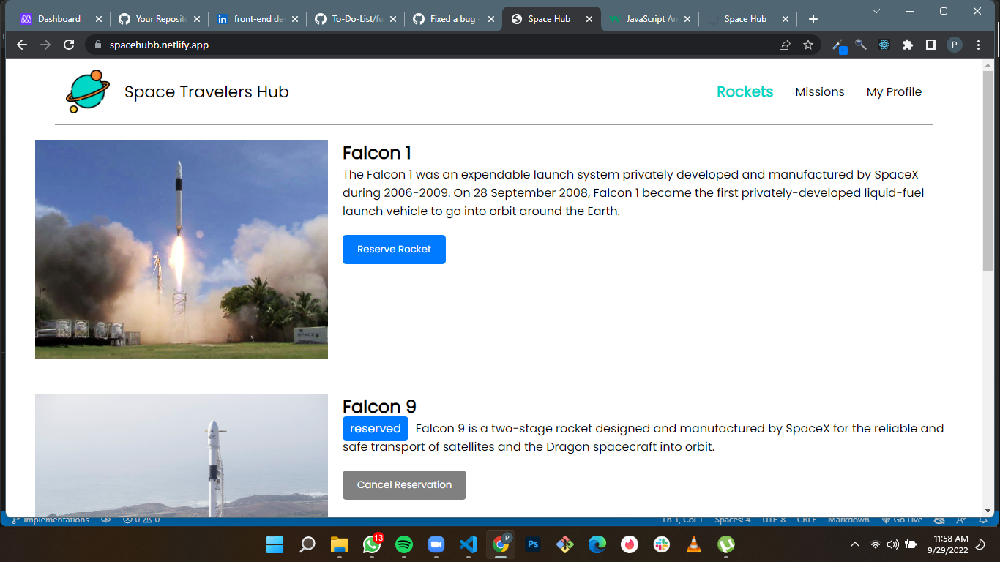
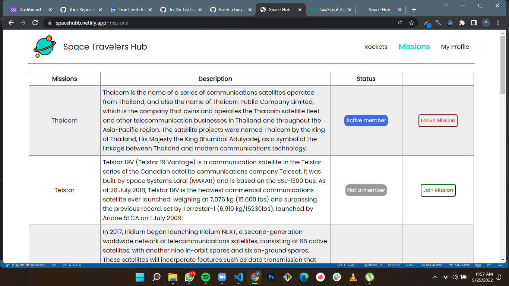
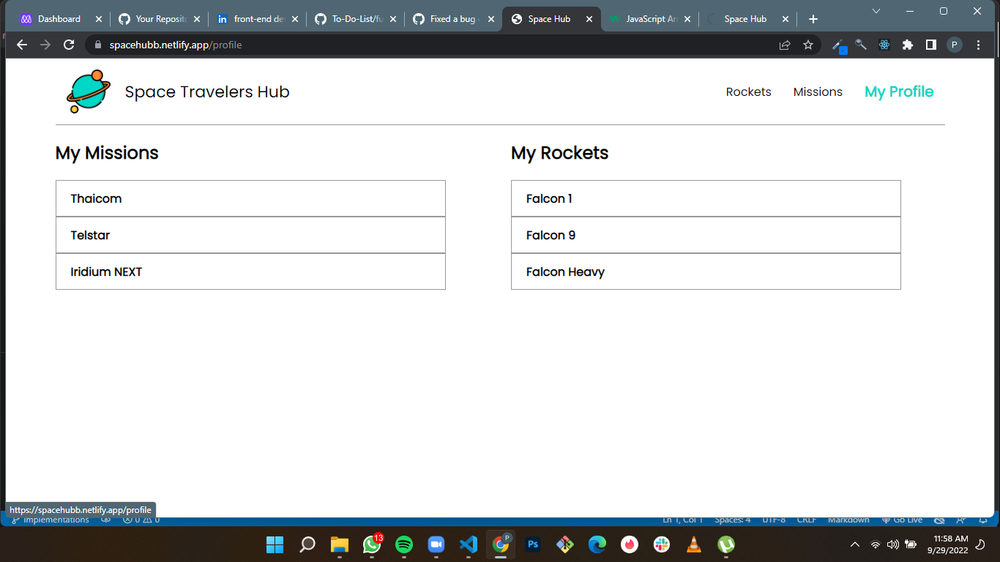

# Space Travelers Hub

> This is a web based app which is showing information about the spaceX rockets and missions.
> A user can reserve rockets and missions with the app.

## Built With

- HTML, CSS, JavaScript
- React
- Redux
- WebPack 

## Live Demo 

[Live Demo Link](https://spacehubb.netlify.app/)

## ScreenShots

## Getting Started

To get a local copy up and running follow these simple example steps.

### Prerequisites

- Install node.js and npm.
- Install Git.

### Setup

- Clone the repository by running the following command in your terminal:
    git clone https://github.com/PromzzyKoncepts/Space-Travellers-Hub.git
    
- Change your directory by by running the following command in your terminal:
    cd space-hub

### Install
- Install the dependencies by running `npm i` in your terminal

### Usage

- After all the dependencies are installed open the app by running npm start in your terminal

### Deployment

## Authors

👤 **PROMISE OKECHUKWU**

- GitHub: [@promzzykoncepts](https://github.com/PromzzyKoncepts)
- Twitter: [@pr0mzzy](https://twitter.com/prOmzzy)
- LinkedIn: [promiseokechukwu](https://linkedin.com/in/promiseokechukwu)

👤 **Habib Payenda**

- GitHub: [@HabibPayenda](https://github.com/githubhandle)
- Twitter: [@HabibPayenda](https://twitter.com/twitterhandle)
- LinkedIn: [@HabibPayenda](https://linkedin.com/in/linkedinhandle)

## 🤝 Contributing

Contributions, issues, and feature requests are welcome!

Feel free to check the [issues page](../../issues/).

## Show your support

Give a ⭐️ if you like this project!

## Acknowledgments

- Hat tip to anyone whose code was used
- Inspiration
- etc

## 📝 License

This project is [MIT](./MIT.md) licensed.
